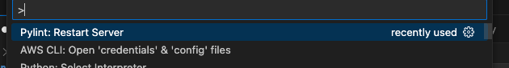

# Testing
This project provides resources and examples for various software best concepts and practices. It aims to be a valuable learning tool for developers and testers.

## Software Tools Overview

### PyTest

- Pytest is a popular Python testing framework known for its flexibility, expressiveness, and ease of use. It promotes writing clean, readable tests with features like fixtures, parametrization, and assertions.

### Coverage

- Coverage is a Python library that calculates the percentage of your code that is executed by your tests. This helps you identify areas where you might need to write more tests to achieve better code coverage.

### Linting(Pylint)

- Linting is an automated process that analyzes your code to identify potential errors, stylistic inconsistencies, and readability issues. It's like a grammar and style checker for programmers, helping you maintain clean, consistent, and well-formatted code.

### Code formatter (black)
- Code formatters are tools that automatically format your code according to a set of rules or style guides. They can fix indentation, spacing, alignment, line breaks, and other aspects of code appearance.

### Precommit Hooks (pre-commit)
- Pre-commit hooks are scripts that execute before you commit your code changes in a Git repository. They act as a safety net, automatically running checks and validations on your code to identify potential issues before they are integrated into the main codebase.

### Installation
 ```bash
    pip install pytest coverage pylint black pre-commit
 ```

## Instructions
- Create a `test` folder
- Create a test file for each of your python file implementation with the name either starting, ending or having `test` in it. Eg `test_` , `_test_`, `_test.py`.
- The names of your test methods should start with `test_`
- Write your unit test and integration test in all of the test files.
- You can run your test either by running this at the root directory
    ```bash
        pytest
    ```

    Or

    ```bash
        pytest test/test_class.py
    ```
- Next you check for test coverage. Create `.coveragerc` file
   ```bash
        touch .coveragerc
   ```
- Add the following into it. Note: Use the name of the directoey containing your logic
   ```bash
        [run]
        source = src
   ```
- Run the following to generate a coverage report
   ```bash
        coverage run -m pytest -v
        coverage report -m
        coverage html
   ```

## Pytest basic command
- To run pytest use
   ```bash
        pytest
   ```
   this runs all the files with starting or ending `test_` or have `test` in them
- To get pytest to print things to the commandline use -s flag
   ```bash
        pytest test_case/test_circle.py -s
   ```
-  To see each test case in each test file being run do this pytest -v
   ```bash
        pytest -v
        pytest test_case/test_rectangle.py -v
   ```
- To run a particular marker do this
   ```bash
        pytest -m slow
   ```
- To run a particular test function in a test file do this
   ```bash
        pytest test_case/test_api.py::test_can_list_tasks
   ```


## Pylint setup and basic command
- Install pylint extension on vscode
- Start the pylint server by going to the command palette

  

- To run pylint on terminal
   ```bash
      pylint --recursive=y .
   ```

## Black basic usage
- Black is the uncompromising Python code formatter
   ```bash
      black --diff . | less
      black test_case/test_my_function.py --diff
      black test_case/test_my_function.py
   ```

## Pre-commit setup and basic command
- Install the pre-commit hook:
   ```bash
      pip install pre-commit
   ```
- Create a configuration file called `.pre-commit-config.yaml`
   ```bash
      pre-commit sample-config > .pre-commit-config.yaml
   ```
-  Run against all the files
   ```bash
      pre-commit run --all-files
   ```
- To automate pre-commit checks, you will have to install the git hook scripts.
   ```bash
      pre-commit install
   ```
- Now pre-commit checks is done after every commits
- Now you can make changes and commit. It should return something like this:
